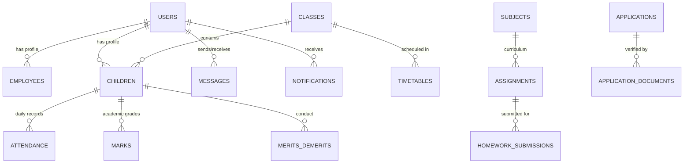

# Fusion High School Management & Learning Platform
## Comprehensive System Architecture & Technical Documentation

---

## 1. Executive Summary & Platform Overview

**Fusion High School** is an enterprise-grade School Information System (SIS) and Learning Management Platform (LMS) specifically designed for the **South African Curriculum Assessment Policy Statements (CAPS)** ecosystem spanning **Grades 8 through 12**.

The platform provides a unified, real-time operating environment for four primary user groups:
- **Learners**: Interactive subject hubs, real-time DBE past papers & memoranda, AI Voice Tutoring in official South African languages, homework submissions, gamified XP progression, APS university admission score simulation, and interactive digital report cards.
- **Teachers**: Workload management, automated CAPS mark recording and weightings, real-time period/subject attendance tracking with automated parent notification emails, AI lesson planning and test paper generation, relief timetable swaps, and textbook inventory management.
- **Parents**: Real-time multi-child academic monitoring, period-by-period attendance oversight, official CAPS term report cards, instant direct messaging (with voice notes, pictures, and PDF sharing), and Parent-Teacher Conference slot bookings.
- **School Administrators**: School-wide metadata and staff role assignment, automatic timetable conflict resolution and publishing, admissions management powered by neural document OCR and Home Affairs ID verification, conduct and disciplinary tracking, and Matric analytical projectors.

---

## 2. Technology Stack & Architectural Overview

```
+-----------------------------------------------------------------------------------+
|                                  CLIENT LAYER                                     |
|  React 18  •  TypeScript  •  Vite  •  Tailwind CSS  •  Lucide Icons  •  PWA App  |
+-----------------------------------------+-----------------------------------------+
                                          | REST API & Multi-part Uploads
                                          v
+-----------------------------------------------------------------------------------+
|                              BACKEND & API GATEWAY                                |
|  Node.js  •  Express.js  •  JWT Authentication  •  Multer Uploads  •  Nodemailer  |
+--------------------+--------------------+--------------------+--------------------+
                     |                    |                    |
                     v                    v                    v
+-------------------------+ +-------------------------+ +-------------------------+
|    POSTGRESQL ENGINE    | |     AI & OCR SUITE      | |    COMMUNICATION HUB    |
|   40 Relational Tables  | |  • Voice Tutor (STT/TTS)| |  • Voice Notes Recorder |
|   Foreign Key Integrity | |  • Admissions Doc OCR   | |  • Image Lightbox & Docs|
|   Indexed Queries & Pool| |  • CAPS Test Generator  | |  • Email Alert System   |
+-------------------------+ +-------------------------+ +-------------------------+
```

### 2.1 Technology Components
- **Frontend Core**: React 18, TypeScript, Vite 6, Tailwind CSS 3.
- **State & UI Utilities**: React Context API, Lucide React Icons, Canvas Confetti, Custom Waveform Equalizer, Fullscreen Image Lightbox.
- **Backend Server**: Node.js 20+, Express.js, CORS, Body-Parser.
- **Database Engine**: PostgreSQL 16 with `pg-pool` connection pooling and relational foreign-key integrity across 40 tables.
- **Security & Authorization**: JWT (JSON Web Tokens), `bcrypt` password hashing, Role-Based Access Control (RBAC) middleware (`isAdmin`, `isTeacher`, `isLearner`, `isParent`).
- **File & Media Storage**: Local structured filesystem hierarchy with Multer validation for avatars, past exam papers, homework attachments, admission documents, and chat voice/media notes.
- **AI & Audio Engines**: Web Speech Recognition API (Speech-to-Text), Web SpeechSynthesis (Text-to-Speech), PDF text parsing & extraction, heuristic SA ID Luhn algorithm verifier, neural subject tutoring engines.

---

## 3. Database Architecture (40 Relational Tables)

The database schema is organized into structured domains with strict foreign keys and cascading updates.



### 3.1 Domain Breakdown

1. **Authentication & Core Users**:
   - `roles`: System access tiers (`admin`, `teacher`, `learner`, `parent`).
   - `users`: Credentials, personal demographics (full name, email, phone, race, gender, date of birth, South African ID number), profile photo paths, active status.
   - `departments`: Administrative and academic divisions.
   - `employee_roles`: Job descriptions and salary grades.
   - `employees`: Staff metadata, hire dates, assigned departments, and roles.
   - `parent_learner`: Many-to-many relationship linking parents to their children.

2. **Academics, Classes & Curriculum**:
   - `grades`: Grades 8 through 12 configuration.
   - `classes`: Grade classes (e.g., 10A, 11B) with assigned streams (Science, Commerce, Tourism, General) and capacity limits.
   - `subjects`: CAPS curriculum subjects with grade levels and credit weights.
   - `topics`: Term-by-term curriculum syllabus breakdowns.
   - `learner_subjects`: Individual subject enrollments per learner.
   - `teacher_subjects`: Educator subject assignments.

3. **Assessments, Homework & AI Grading**:
   - `assignments`: Homework, projects, tests, and practical tasks created by educators with due dates and max marks.
   - `homework_submissions`: Learner submissions with uploaded attachments, text answers, submission timestamps, and AI-evaluated marks and feedback.
   - `marks`: Formal school marks categorized by term (Terms 1–4) and assessment type (SBA, Test, Exam).
   - `past_papers`: Official DBE question papers and marking memoranda categorized by Grade (8–12), Subject, and Paper (P1, P2, P3).

4. **Attendance & Absence Notification**:
   - `attendance`: Period-level and daily attendance tracking (Present, Absent, Late, Excused) with automated parent email dispatch flags.

5. **Admissions & Neural OCR Verification**:
   - `applications`: Prospective learner registrations, provisional numbers, grade applied, streams, address, and primary parent contacts.
   - `application_documents`: Scanned South African Smart IDs, Birth Certificates, Proof of Residence, and Clinic Cards with AI OCR clarity scores and verification logs.

6. **Conduct & Disciplinary Management**:
   - `merits_demerits`: Positive and disciplinary conduct points recorded by educators with categories, parent notification flags, and detention assignment tracking.

7. **Extracurricular Activities & Sports**:
   - `extracurricular_activities`: Sports codes (Soccer, Netball, Rugby, Athletics) and cultural clubs with coaches and training venues.
   - `extracurricular_members`: Learner activity registrations and jersey numbers.
   - `extracurricular_events`: Inter-school fixtures, tournaments, match results, and scores.

8. **Textbook & Resource Asset Tracker**:
   - `textbook_inventory`: Master textbook records with ISBN, subject, grade, total stock, and available copies.
   - `textbook_issues`: Barcode-tracked book loans, issue dates, expected returns, return condition grading, and replacement fee assessments.

9. **Educator Leave & Relief Scheduling**:
   - `leave_requests`: Teacher leave applications (Sick, Annual, Study, Maternity) with start/end dates and supporting documents.
   - `relief_allocations`: Automatic and manual class relief teacher substitutions.
   - `timetable_swap_requests`: Educator peer-to-peer lesson swap approvals.

10. **Parent-Teacher Conferences (PTC)**:
    - `ptc_slots`: 15-minute educator consultation time slots with dates, meeting modes (In-Person / Video Call), and parent booking statuses.

11. **Communication Hub & Messaging**:
    - `messages`: Direct messaging system supporting text, audio voice recordings, image attachments, and PDF/Word documents.
    - `notifications`: Real-time system notifications and alerts.
    - `announcements`: School-wide and grade-specific announcements.

---

## 4. Feature Modules & Role Portal Specifications

### 4.1 Learner Portal

```
+--------------------------------------------------------------------------------+
|                                LEARNER DASHBOARD                               |
|  [Subjects Hub]  [AI Voice Tutor]  [Past Papers]  [APS Calculator] [CAPS Report]|
+--------------------------------------------------------------------------------+
```

- **Interactive Subject Hub**: Personalized dashboard displaying enrolled subjects, topic completion rates, upcoming due dates, and academic progress indicators.
- **AI Voice Tutor (Speech-to-Text & Text-to-Speech)**:
  - Voice dictation microphone allowing learners to speak their questions.
  - Multi-language tutoring support for South Africa's 11 official languages (*isiZulu, isiXhosa, Afrikaans, English, Sepedi, Setswana, Sesotho, Xitsonga, siSwati, Tshivenda, isiNdebele*).
  - Audio read-aloud playback with animated sound wave equalizers, speed adjustment (`1.0x`, `1.25x`), and markdown formula cleanup.
  - Practice quiz generation with automated scoring and celebratory animations.
- **DBE Past Question Papers & Memos**: Dedicated tab granting immediate access to Grade 8–12 past examination papers and official marking memos partitioned by subject stream.
- **Homework Submission Engine**: Multi-format submissions with document attachments, instant confirmation receipts, and feedback reviews.
- **APS University Admission Simulator**: Interactive admission point score calculator mapping Grade 12 results against requirements for South African universities (UCT, Wits, UP, Stellenbosch, UJ).
- **Gamification Engine**: Dynamic experience points (XP), learning streak counters, achievement badges, and grade leaderboards.

---

### 4.2 Teacher Portal

```
+--------------------------------------------------------------------------------+
|                                TEACHER DASHBOARD                               |
| [Class Rosters] [Period Attendance] [CAPS Markbook] [AI Test Gen] [Relief Swaps]|
+--------------------------------------------------------------------------------+
```

- **Classroom Attendance Hub**:
  - One-click period attendance marking with real-time summary statistics.
  - Automatic background email alerts sent directly to registered parents when a learner is flagged absent or unexcused.
- **CAPS Markbook & Grade Allocation**:
  - Direct recording of School-Based Assessments (SBA), practical tasks, mid-year exams, and final assessments.
  - Automatic calculation of weighted percentages and CAPS achievement levels (1 to 7).
- **AI Assessment & Lesson Plan Generator**:
  - Automated generation of CAPS-aligned lesson plans with learning outcomes and differentiated activities.
  - Test and exam paper generator with question allocation, Bloom's Taxonomy cognitive levels, and complete marking memos.
- **Educator Leave & Relief Manager**:
  - Leave application submission with digital medical certificate uploads.
  - Relief roster inspection and peer lesson swap requests.
- **Parent-Teacher Conference Manager**:
  - Configurable consultation slots with direct parent booking management.

---

### 4.3 Parent Portal

```
+--------------------------------------------------------------------------------+
|                                 PARENT PORTAL                                  |
| [Child Switcher] [Live Attendance] [Term Reports] [Chat & Voice] [PTC Bookings]|
+--------------------------------------------------------------------------------+
```

- **Multi-Child Dashboard**: Seamless switching between multiple enrolled children to view individualized progress, schedules, and attendance records.
- **Attendance Monitoring**: Period-by-period attendance logs with instant status indicators.
- **Official CAPS Digital Report Cards**: Interactive Term 1 through Term 4 report cards showing subject marks, class averages, grade distributions, and educator comments.
- **Direct Teacher Messaging**: Secure messaging supporting audio voice notes, photo attachments, and PDF document sharing.
- **Parent-Teacher Conference Bookings**: One-click consultation booking with child educators.

---

### 4.4 Admin Portal

```
+--------------------------------------------------------------------------------+
|                                  ADMIN PORTAL                                  |
| [User Directory] [Timetable Builder] [Admissions OCR] [Conduct] [Asset Tracker]|
+--------------------------------------------------------------------------------+
```

- **User & Staff Directory**: Complete management of administrators, educators, learners, and parents with role permissions, employee records, and credentials.
- **Neural Admissions & Document OCR Verification**:
  - Interactive OCR inspector evaluating uploaded Parent IDs, Learner Birth Certificates, and Proof of Residence.
  - Neural clarity scoring (0–100%) and South African Home Affairs 13-digit ID Luhn algorithm checksum validation.
  - Cross-matching between extracted document metadata and application form inputs.
  - One-click application approval, class allocation, or document correction requests.
- **Automated Timetable Generation**: Automated engine allocating classes, educator assignments, and periods while avoiding scheduling conflicts.
- **Behavior & Incident Management**: School-wide conduct logs, merit/demerit points, disciplinary records, and detention tracking.
- **Asset & Textbook Inventory**: ISBN-based book tracking, issue/return logging, loss assessment, and stock audit reporting.
- **Matric Analytical Projector**: Statistical analysis of Grade 12 cohort performance, subject pass predictions, and bachelor degree pass rate projections.

---

## 5. Neural & Artificial Intelligence Capabilities

```
+-----------------------------------------------------------------------------------+
|                            AI ENGINE SUBSYSTEMS                                   |
+--------------------------+--------------------------+-----------------------------+
|     AI VOICE TUTOR       |   ADMISSIONS OCR SUITE   |    ASSESSMENT GENERATOR     |
| • Web Speech Dictation   | • Home Affairs Checksum  | • CAPS Exam Papers & Memos  |
| • 11 SA Languages Speech | • Scan Clarity Scoring   | • Automated Rubric Grading  |
| • Step-by-Step Solutions | • Document Cross-Match   | • Bloom's Taxonomy Balance  |
+--------------------------+--------------------------+-----------------------------+
```

### 5.1 AI Voice Tutor
- **Speech-to-Text Pipeline**: Uses the browser `SpeechRecognition` interface with South African regional language configurations (`en-ZA`, `af-ZA`, `zu-ZA`) to convert learner speech into structured queries.
- **Natural Voice Synthesis**: Implements `SpeechSynthesisUtterance` with clean text pre-processing (markdown stripping and equation normalization) and audio equalizer waveform visualization.
- **Curriculum Guardrails**: AI answers are bounded to the active subject and topic to ensure learners receive relevant guidance.

### 5.2 Neural Document OCR & Integrity Verifier
- **High-Definition Clarity Scoring**: Analyzes resolution, contrast, and text density of uploaded documents (PDF, JPG, PNG) to compute a 0–100% readability rating.
- **South African ID Number Validation**: Applies the Luhn algorithm to check the 13-digit identity string, extracting Date of Birth (`YYMMDD`), gender (`SSSS`), and citizenship status.
- **Authenticity Check**: Verifies Department of Home Affairs and DBE stamps and certified copy indicators.

### 5.3 Automated Assessment & Lesson Planning
- Generates structured test questions across cognitive levels (Knowledge, Routine Procedure, Complex Procedure, Problem Solving).
- Automatically writes step-by-step marking guidelines with mark breakdowns (e.g., `[2 Marks]`, `[5 Marks]`).

---

## 6. Communication & Media Sharing Hub

The communication subsystem allows real-time interactions across all school stakeholders:
- **Audio Voice Notes**: Built with the `MediaRecorder` API to record `.webm` / `.mp3` audio clips, complete with live recording timers, discard buttons, and in-bubble audio players with progress scrubbers.
- **Image Sharing & Lightbox**: Image uploads with thumbnail previews, hover zoom animations, and an interactive fullscreen lightbox with zoom controls and one-click download.
- **Document Attachments**: Support for PDF and Word documents with file icons, formatted file size indicators, and direct download links.
- **File Validation & Security**: Server-side Multer middleware filtering file types and restricting attachments to a maximum of 25MB per file.

---

## 7. Security, Access Control & API Reference

### 7.1 Security Architecture
- **Authentication**: JWT signed with secret keys and configurable token expiration.
- **Password Security**: Salted `bcrypt` hashing for all user accounts.
- **Role-Based Access Control**: Middleware enforcement on every endpoint:
  - `authenticateToken`: Validates JWT bearer token.
  - `isAdmin`: Restricts administrative routes.
  - `isTeacher`: Restricts academic and marking actions.
  - `isLearner`: Restricts student-only portals.
  - `isParent`: Ensures parents only access data for linked children.
- **Data Protection**: Prepared SQL parameterization (`$1, $2, ...`) across all database queries to prevent SQL injection vulnerabilities.

### 7.2 Core API Endpoints

| Category | Method | Endpoint | Description | Auth Tier |
| :--- | :--- | :--- | :--- | :--- |
| **Auth** | `POST` | `/api/login` | User authentication & JWT issuance | Public |
| **Auth** | `POST` | `/api/register` | User account registration | Public |
| **Auth** | `POST` | `/api/forgot-password` | OTP generation for password reset | Public |
| **Messages** | `GET` | `/api/messages` | Fetch user message threads | Authenticated |
| **Messages** | `POST` | `/api/messages` | Send message with attachments/voice | Authenticated |
| **Messages** | `POST` | `/api/messages/upload` | Upload audio voice notes, images, PDFs | Authenticated |
| **Learner** | `POST` | `/api/learner/ask-tutor` | Query AI Voice Tutor with topic context | Learner |
| **Learner** | `GET` | `/api/learner/subjects` | Fetch enrolled subjects & progress | Learner |
| **Learner** | `POST` | `/api/learner/simulate-aps` | Calculate university APS score | Learner |
| **Teacher** | `POST` | `/api/teacher/attendance` | Record period attendance & notify parents | Teacher |
| **Teacher** | `POST` | `/api/teacher/marks/save` | Record CAPS assessment marks | Teacher |
| **Teacher** | `POST` | `/api/teacher/ai/generate-test-paper` | Generate CAPS test paper & memo | Teacher |
| **Parent** | `GET` | `/api/parent/children-detailed` | Fetch linked children & live overview | Parent |
| **Parent** | `GET` | `/api/reports/caps-report-card` | Generate official CAPS Term Report Card | Parent / Learner |
| **Admin** | `GET` | `/api/admin/admissions` | Fetch all admission applications | Admin |
| **Admin** | `POST` | `/api/admin/admissions/:id/ocr-inspect` | Run Neural Document OCR & ID Checksum | Admin |
| **Admin** | `PATCH`| `/api/admin/admissions/:id` | Update admission status & class allocation | Admin |

---

## 8. Installation, Deployment & System Administration

### 8.1 Prerequisites
- **Node.js**: v18.0.0 or higher
- **PostgreSQL**: v14.0 or higher
- **npm** or **yarn**

### 8.2 Environment Configuration (`.env`)
```env
# Database Settings
DB_HOST=localhost
DB_PORT=5432
DB_USER=postgres
DB_PASSWORD=your_secure_password
DB_NAME=FUSION_DB

# Authentication
JWT_SECRET=your_jwt_signing_secret_key

# Server Ports
PORT=4000
IP=127.0.0.1

# SMTP Email Dispatch
SMTP_USER=notifications@fusionhigh.co.za
SMTP_PASS=your_smtp_app_password
```

### 8.3 Running the Application
```bash
# 1. Install Backend & Frontend Dependencies
npm install
cd client && npm install && cd ..

# 2. Initialize PostgreSQL Database Schema
psql -U postgres -d FUSION_DB -f db/schema.sql

# 3. Build Client Application
cd client && npm run build && cd ..

# 4. Start Server
npm start
# Server will run on http://localhost:4000
```

---
*Documentation compiled for the Fusion High School Management & Learning Platform (Version 2.1).*
